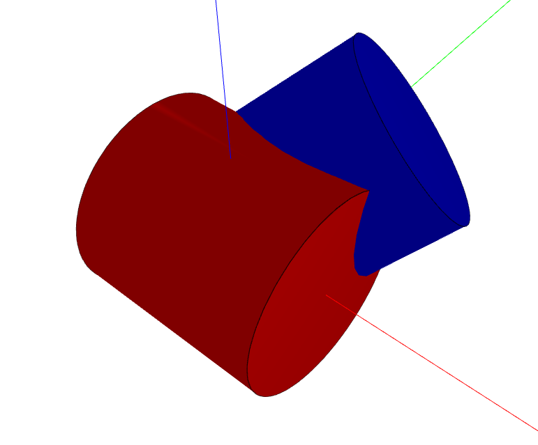
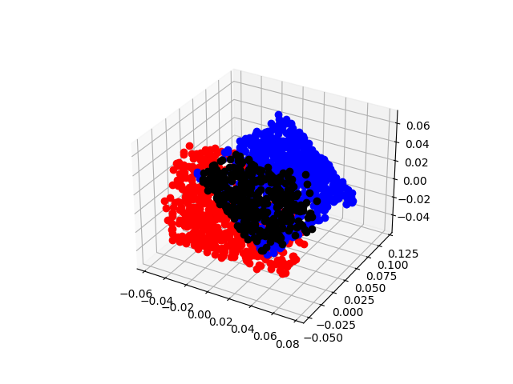
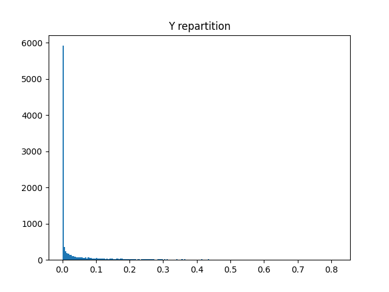
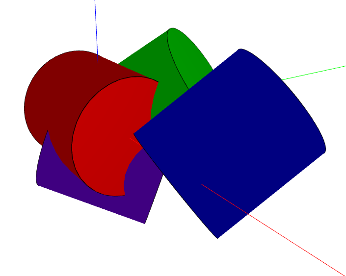

# Cylinder interference

Experimentation on cylinder inference using approximated methods and regression models.

*This project has been realized in the context of my apprenticeship at Dessia Technologies*
***

### 0. Approximation method

The first script shows how the percentage of interference is approximated.

1. I draw points distributed inside the first cylinder by making a LHS
2. I look at the proportion of points belonging to the second cylinder to estimate the percentage of interference.

#### Example




It works with pretty good accuracy and it's very robust.

`% of intersection : 54.559505409582684%`


### 1. Generation

During generation, a first `Cylinder` stay inplace, and a second is placed using 2 variables :
- a point randomly chosen in a sphere around 1st the `Cylinder`, corresponding to the center of the 2nd `Cylinder`
- a random vector, representing the Z-axis of the local frame of the 2nd `Cylinder`

This way, I want to represent all the possible relative placing of 2 `Cylinder`.

This PLEX can be done differently.


You can play with 3 parameters for generation :
- `SIZE_SAMPLE` which is the number of points generated
- `N_POINTS_VOLUME` which is the number of points used to estimate the interference volume using Monte-Carlo approximated method
- `GEN_COEFF` which is a coefficient determining the size of the sphere inside points are randomly chosen

You can use multiprocessing during generation to increase calculation speed, by setting the parameter `use_multiprocessing` to `True`.
It works with the `multiprocessing` python library, and allow you to use all your CPU cores, instead of only one.
It doesn't work with iPython, so you must have to launch the script in a terminal.

At the end of generation, it gives you some information :
```
y=0: 51.24999999999999%
file written : data_10000_5000.csv
time taken: 195.63077117700004s
```

And plot the Y repartition. 
Y is not uniformly reparted but it's normal and better, because you have much more different configurations for 5% interference tha you have for 50% interference.




### 2. Training

For training, you must specify the path where generated data was stored, something like `data/data_10000_1500.csv`

During training, it trains 2 model : 
- a multi-layer perceptron regressor
- a random forest regressor

It saves them using `joblib` library in the `model` folder. It also saves the scaler.

It also tests the model, as the data is split at the beginning, by computing r² on testing data :
```
neural network r²: 0.9869716142479553
random forest r²: 0.9830258904859136
```

### 3. Verification and performance

This script is used for visual verification.

It generates some configuration, represents the in 3D using babylonjs, and print the estimation and the prediction of % of interference.



```
red and red (clone)
Estimation: 100.0%
RF prediction: 75.63300000000004%
MLP prediction: 76.15921063100105%

red and green
Estimation: 36.29%
RF prediction: 28.607600000000005%
MLP prediction: 35.52883319912049%

red and blue
Estimation: 0.01%
RF prediction: 0.0574%
MLP prediction: 1.7479022324659672%

red and purple
Estimation: 52.56999999999999%
RF prediction: 45.21279999999999%
MLP prediction: 54.432814566221744%

red (clone) and red
Estimation: 100.0%
RF prediction: 75.63300000000004%
MLP prediction: 76.15921063100105%

red (clone) and green
Estimation: 36.29%
RF prediction: 28.607600000000005%
MLP prediction: 35.52883319912049%

red (clone) and blue
Estimation: 0.01%
RF prediction: 0.0574%
MLP prediction: 1.7479022324659672%

red (clone) and purple
Estimation: 52.56999999999999%
RF prediction: 45.21279999999999%
MLP prediction: 54.432814566221744%

green and red
Estimation: 35.49%
RF prediction: 38.3374%
MLP prediction: 36.32194520971013%

green and red (clone)
Estimation: 35.49%
RF prediction: 38.3374%
MLP prediction: 36.32194520971013%

green and blue
Estimation: 3.47%
RF prediction: 4.673200000000003%
MLP prediction: 3.7383702603285442%

green and purple
Estimation: 31.81%
RF prediction: 31.9164%
MLP prediction: 29.327990949738382%

blue and red
Estimation: 0.0%
RF prediction: 0.7148%
MLP prediction: 0.25809579527253657%

blue and red (clone)
Estimation: 0.0%
RF prediction: 0.7148%
MLP prediction: 0.25809579527253657%

blue and green
Estimation: 3.5999999999999996%
RF prediction: 2.7558000000000007%
MLP prediction: 1.2820042045653706%

blue and purple
Estimation: 0.0%
RF prediction: 0.024800000000000003%
MLP prediction: -0.14100035037774294%

purple and red
Estimation: 52.15%
RF prediction: 53.31819999999997%
MLP prediction: 57.67817441102715%

purple and red (clone)
Estimation: 52.15%
RF prediction: 53.31819999999997%
MLP prediction: 57.67817441102715%

purple and green
Estimation: 31.61%
RF prediction: 30.023199999999996%
MLP prediction: 32.26801520098941%

purple and blue
Estimation: 0.0%
RF prediction: 0.0636%
MLP prediction: 0.3568029676963985%
...
```
This script also tests performance :

```
PERFORMANCE TEST
Approximation, time per calculus: 192.70695768999983 ms
MLP, time per calculus: 0.05575683999950343 ms
RF, time per calculus: 4.812478700000611 ms
```

### 4. Validation

This script does cross-validation using scikit-learn built-in libray. Can be maybe improve.
```
neural network cross validation r²: [0.9917538  0.98716433 0.99011082 0.98828016 0.98991578 0.99107386
 0.99038289 0.98735404 0.98838636 0.98821109]
 
random forest cross validation r²: [0.98398031 0.98328499 0.98328183 0.98390223 0.98440689 0.98332359
 0.98353045 0.98369089 0.98282001 0.98391388]
```
